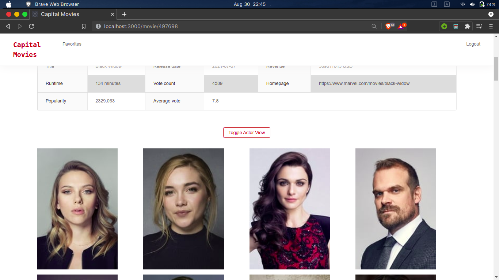

# Capital Movies


## Table of Contents

- [About the Project](#about-the-project)

- [Built With](#built-with)

- [Getting Started](#getting-started)

- [Prerequisites](#prerequisites)

- [Installation](#installation)

- [Usage](#usage)

- [Roadmap](#roadmap)

- [Contributing](#contributing)

- [License](#license)

- [Contact](#contact)

<!-- ABOUT THE PROJECT -->

## About The Project

Practicing MERN stack. TMDb API used for this project. --> https://www.themoviedb.org/

### Built With

- [MongoDB]()

- [ExpressJS]()

- [ReactJS]()

- [NodeJS]()

<!-- GETTING STARTED -->

## Getting Started

To get a local copy up and running follow these simple steps.

### Prerequisites

This is an example of how to list things you need to use the software and how to install them.

- npm

```sh

npm install npm@latest -g

```

### Installation

1. Clone the moviesMERN

```sh

git clone https://github.com/kmaodus/moviesMERN.git

```

2. Install server NPM packages (inside root folder)

```sh

npm install

```

3. Install NPM packages in client directory

```sh
cd client

npm install


```

4. Cd back to root directory and run

```sh
cd ..
npm start

```

<!-- USAGE EXAMPLES -->

## Usage

You can register if you want to add movies in your favorites list, otherwise you can view latest popular movies and view detailed movie info by clicking on an image. If you are logged in you can also leave comments and likes on a movie.





